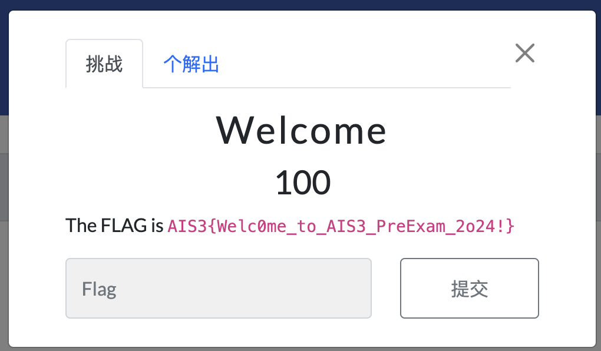
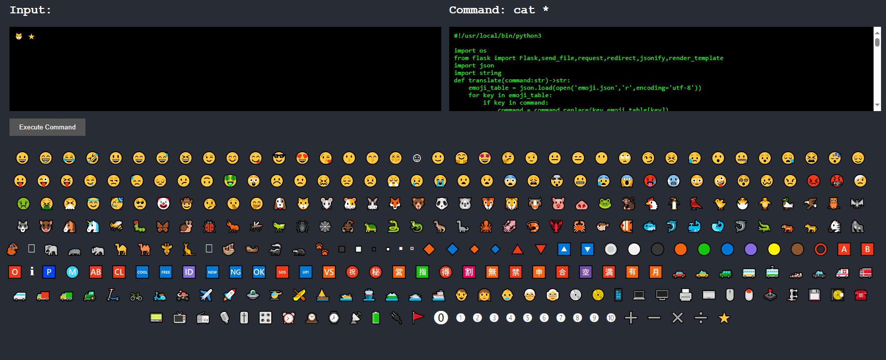
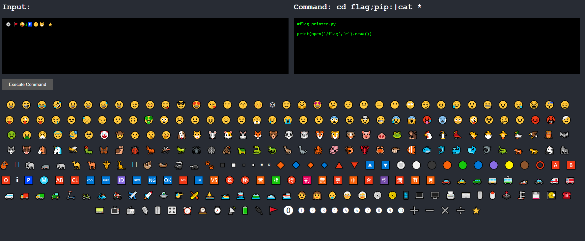
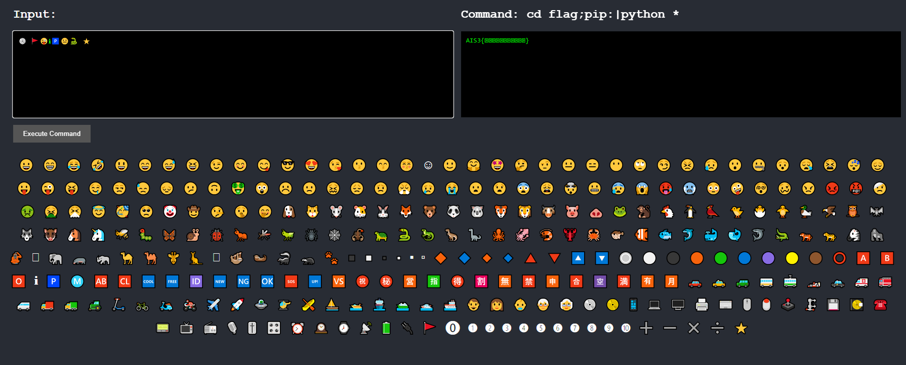

## Welcome

flag即在題目敘述中

## Three Dimensional Secret

將檔案下載下來解壓縮可以發現是wireshark的檔案

可以發現主要的通訊是TCP協議，利用follow功能可以看到傳輸了什麼東西

由傳輸內容可以發現是使用Cura生成的gcode

將其內容寫入一個新檔案並將其副檔名設為.gcode

在cura import這個檔案即可獲得flag

## Emoji Console

利用cat及萬用字元可以發現目錄下有一個叫flag的目錄及拿到python源代碼，同時可以知道各種表情符號所代表的文字

構建如下指令後可以發現，flag下有個可以讀flag的python檔

因此利用以下指令即可讀到flag

