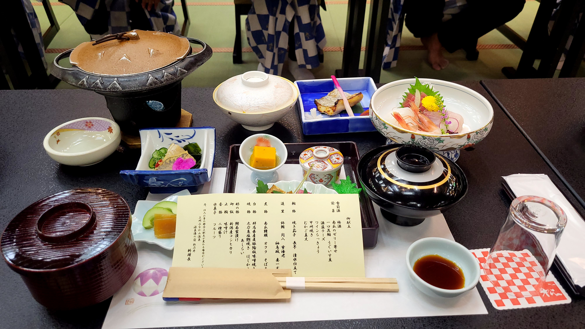
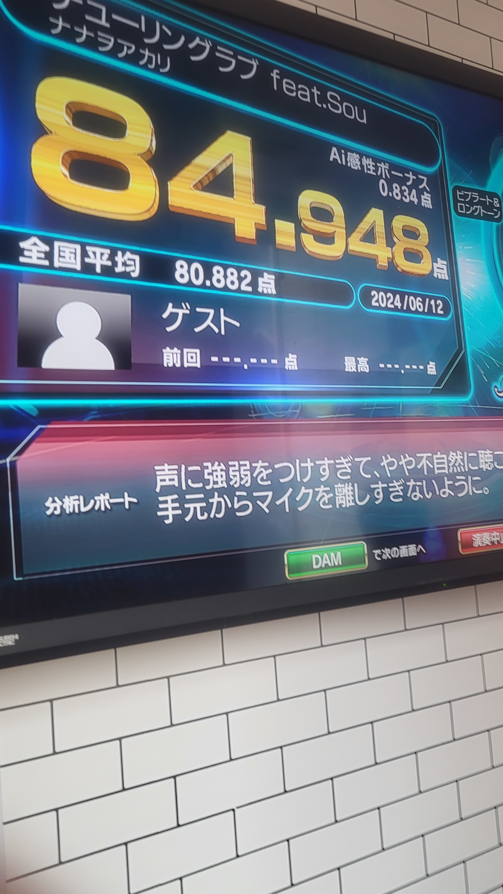
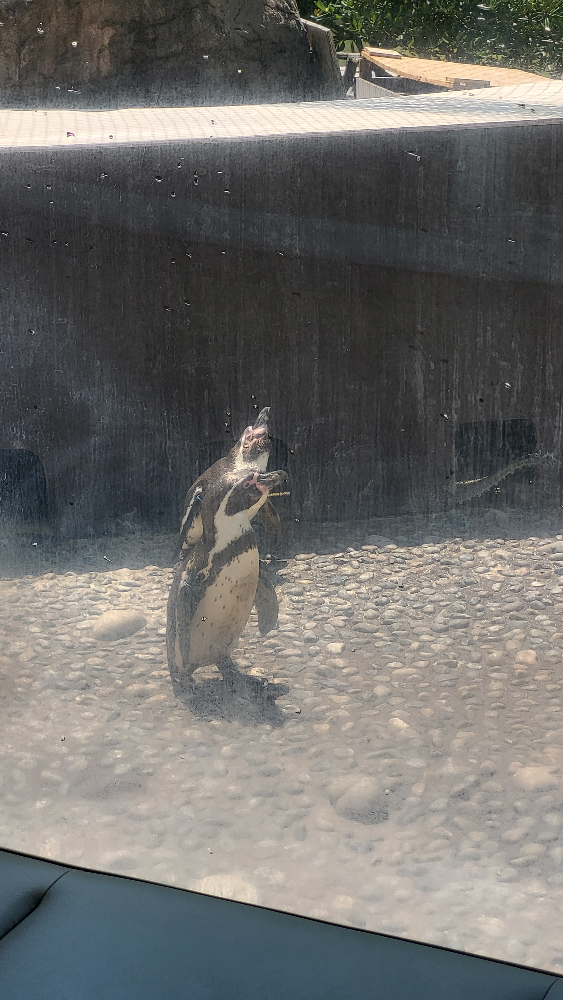
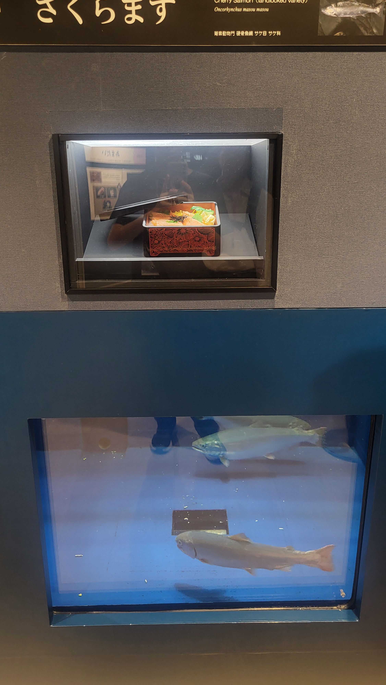
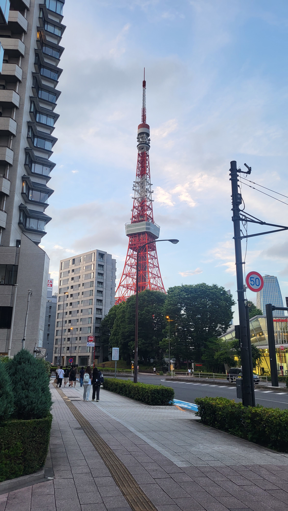
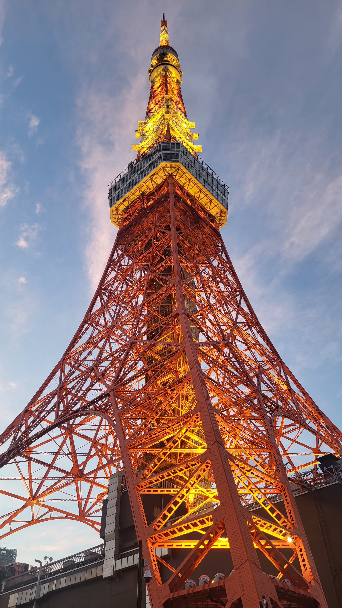

## 第一天--出發

前一天晚上我整個在通宵，所以隔天我整天腸胃都不舒服，所以很多東西沒有體驗到有點可惜。雖然是個蠻慘的開始，不過這趟旅程還是有蠻多有趣的地方。順帶一提我已經大概已經8年沒出國了，而且這是我第一次自己出國，所以在蠻多地方都感覺既熟悉又陌生。以下附上飛機的照片：

抵達成田機場後，我們就直接前往新潟，在遊覽車上我都在複習日文，而途中我們有在一個休息站停留一下，所以我就買了雞蛋沙拉吐司跟可爾必思。晚上則是住在群馬縣的溫泉旅館，不過很可惜由於腸胃不適，晚餐的會席料理我沒什麼吃，而裡面的溫泉我也沒去體驗。

## 第二天--抵達新潟南高校

第二天起床後，我們便搭遊覽車到新潟南高校。在開幕式結束後，我們便和學伴一起到學伴的教室上課、吃午餐。其中在導師時間時，我們做了自我介紹及互相介紹自己的家鄉，感覺得出來我用日文自我介紹的時候，底下的有些學生有被嚇到www。而在公民課時，老師要我們用賽局理論去分析不同國家的軍備決策問題，對我來說這非常的新鮮，因為我從來沒想過可以利用賽局理論去考慮經濟問題。一天的課程結束後，我們便和學伴去吃晚餐跟逛街，但我和學伴先去唱卡拉ok，而後再和他的朋友去吃晚餐，吃完晚餐之後我們還利用剩餘的時間逛了一下書店，在那裡看到了一本看起來很詳盡的CTF教學書及各式各樣的書(其中我比較有興趣的是參考書、資訊科技的書和輕小說)。

之後和學伴走回飯店，後面學校有開放讓我們自己去逛新潟，而我跑去新潟車站附近的bigcamera買了final e3000(~~在日本買整整比台灣便宜幾百塊~~)。

## 第三天--和學伴去水族館

早上我們直接前往水族館和學伴會合，順便拍了張日本海。

聽完水族館工作人員的介紹後，我們就開始逛水族館了，其中讓我最印象深刻的是水族館有一個地方是在展新潟地區的海鮮，而他的展出方式是把活生生的海鮮和烹飪過的樣品放在一起展出，十分有趣。同時我也在水族館的海報上發現赤阪老師在新潟有展覽，只可惜沒機會去到。結束在水族館的校外參觀後，我們便回去學伴的學校繼續上課。

放學後，我就和學伴一起去參觀他們的社團，我的學伴是演劇部的，因此我就先去參觀演劇部，很佩服他們社團的設備以及跟戲劇有關的各種書籍都很齊全，同時也很羨慕他們有時間在社團去發展自己的興趣，並且也可以感覺得出來他們是真的熱愛戲劇，而且他們甚至一年要演出數次(我記得是五次)，看他們的演出雖然還不到專業級的程度但也已經有一定水準了。基本上在台灣是沒辦法想像他們到底為甚麼有時間練習以及學習各種演戲技巧，而且在台灣很多人加入社團也只是為了想要殺時間，對社團的活動根本沒有興趣，這是我們的教育值得反思的一點。

接下來我們到了書道部進行參觀，可以看到社員都在臨摹字帖，而社長帶我們參觀了一下他們的作品。可以看到作品中有楷書、隸書、行書。而學伴在參觀的時候，對於各種不同字體好像有些不明白，經過社長的說明了以後才知道不同字體的差異，這也讓我發現我們兩個國家所學的東西不是完全一致的。同時社長也給我看了一下他們練習用的字帖，都是漢字，但感覺跟我們這邊常拿來練習的字帖內容不太一樣，算是蠻有趣的發現。

## 第四天--離開學校，前往homestay

在做完上午家政課的自製日式便當後，我們回到學伴的班上繼續上上午的課，接著在學伴的班上吃家政課做的自製便當。最後我們前往閉幕式，跟學伴做最後的道別。

.jpg)

接下來我們便前往長野縣homestay，home爸跟home媽人都蠻好的，也算是我第一次體驗住在日本人的家裡，雖然和他們相處只有大概半天，不過相處的過程都蠻愉快的，而且他們準備的家庭料理都很美味，真的非常感謝他們的招待。

## 第五天--觀光

第五天我們一邊前往東京一邊觀光，首先是到舊輕井澤銀座通逛街，不過逛了一下都沒特別想買的東西，所以也沒花錢買甚麼。之後中午我們去吃燒烤，還蠻不錯吃的，算是吃得蠻滿足的，然後這裡好像是甚麼節目的拍攝地，以下放上照片讓你們參考。

吃完飯後，我們前往小江戶川越商店街，但一樣我在這邊也沒什麼特別想買的東西，所以也沒買甚麼。不過我們有去看這裡的知名景點--時之鐘，順便在裡面的薬師神社參拜了一下。

.jpg)

結束完這個行程之後我們便前往大宮鐵道博物館，在這裡看到了很多新舊時代的火車及電車，讓我更了解日本鐵道相關的發展歷史。

## 第六天--東京自由行

在東京的自由行，我們先從上野的飯店前往淺草寺參觀，然後我們算是很早到，仲見世通的很多店家都還沒有開門營業。在參拜完後我也順便去求了一個籤詩，接著在離開淺草寺前，我們也有順便去隔壁的淺草神社參拜一下。

接著我們便離開了淺草寺。中間先去了隅田公園，隔著隅田川拍了幾張晴空塔的照片。

接著我們便到UNIQLO淺草店買衣服，剛好看到Capcom四十周年紀念衣，就買了下去。

到了午餐時間，我們搭車到築地市場吃海產，剛好這時太陽也開始變大了。隨後我們找到一家有空位的店便準備用餐，我點的是鮭魚卵和海膽的海鮮丼，但就只是很普通的海鮮丼而已(~~至少我沒吃出來甚麼過人之處~~)。

吃完午餐後，我們便前往車站搭路面電車，其中在車站中有看到孤獨搖滾的海報。到参宮橋駅後，走了一段路到明治神宮，之後又再走了一段路才到明治神宮的本殿。而在本殿參拜完後，我去買了個開運御守，然後便離開明治神宮搭乘山手線前往澀谷。

到了澀谷了以後，我們小組便分開行動，我直接直奔尋找書店。一開始有找到一本我有興趣的關於CTF的教學書(第二段有提到)，雖然內容很詳盡寫的很完整，但由於是日文所以就沒買回來。然而在這之後我一直找不到我想買的其中一套書(ロシデレ)，後來發現輕小說是放在一樓，難怪我一直在B1找都找不到，而且我一開始進入的入口是直通B1的，之後費了好大一番功夫才找到那套書，但後來結帳時發現一樓不能退稅，所以跑回B1去結帳，又由於好像店員沒很熟悉如何辦理退稅的樣子，所以整整大概花了快十分鐘才把書結帳完。但我那時已經超過小組晚餐的集合時間了，所以就直衝我們晚餐要吃的餐廳。

晚餐吃的是一蘭拉麵，雖然很小的時候已經在福岡吃過了，不過這算是睽違大概8年再次吃一蘭拉麵。而這次也做了不一樣的嘗試(~~之前應該都是照推薦點~~)，這次的口味濃淡是普通，油濃郁度調成濃郁，蒜泥普通，蔥的話記得是有青蔥也有白蔥，秘製醬汁因為我不太吃辣所以沒有，叉燒當然是要有，然後麵的硬度選超硬，而這次吃的感想是感受得出來拉麵湯頭的油脂濃郁程度有提升，湯頭變得更濃郁，但鹽度調味不變，而麵也更有韌度。雖然說吃多了這種濃郁的拉麵會感覺到稍微有點膩，不過我另外點的抹茶杏仁豆腐完美的解決了這個問題，在吃完拉麵後，在吃抹茶口味的甜點可以說是非常解膩，不過這次甜點吃到一半就被催趕快吃了，沒有慢慢享受，還是有點可惜。不過總而言之吃的蠻飽的，也很滿足。

接下來我們便前往東京鐵塔啦！雖然我們沒有登上觀景台欣賞東京的夜景，不過有在下面拍到整個東京鐵塔。參觀完東京鐵塔後，我們就一路從港區殺回上野的飯店。

## 第七天--回台灣

雖然說是要回台灣，不過其實沒有馬上殺去機場搭飛機，由於我們要搭飛機的機場是成田機場，又是下午的飛機，所以我們早上就先到千葉觀光。我們這次去的景點是成田山新勝寺，成田山新勝寺的主神是不動明王，參拜完後，我就去求了籤詩，也順便去買了一個學業御守。接著我就去表參道逛街，運氣很好的一扭就扭到了一個三玖的扭蛋，但買了三個賽馬娘扭蛋機吊飾盲盒，都沒抽到我想要的小栗帽和東海帝皇，反而抽到了皇帝魯道夫，女帝氣槽和帝王光輝，到最後是真的沒錢所以就沒再買盲盒來抽了(~~我已經借了1000円了~~)。

之後我們就到了這裡有名的餐廳"菊屋"吃飯，我們這次吃的是他們的炸豬排套餐，總的來說炸豬排的口感非常不錯，外皮酥脆，但豬排本身很扎實，雖然調味沒有很突出，就是普通的炸豬排醬，邊邊還有附上一點黃芥末提供不同的味道，但我認為調味普普，沙拉和醃菜個人覺得不錯吃，味噌湯裡面有類似豆皮的東西，個人還蠻喜歡的。

接下來我們就到機場準備回國了，在機場管制區的免稅店，我幫我媽買了一支刮鬍刀和一盒香蕉蛋糕。然後就上飛機回台灣了。一到台灣下了飛機，有種感覺就是我終於可以說中文了，還有就是馬上感受到台灣空氣的潮濕。拿到行李上了遊覽車之後，我們就從桃機一路回到學校，然後我再走路回到住處。

## 旅行心得感想

關於這趟旅程最大的感想大概不外乎兩件事：

1. 我日文真的好爛：
這次在日本一週的旅程，讓我認識到我的日文能力還不足以和日本人溝通。和學伴及home爸或home媽溝通時，發現自己很多想要表達的意思都不知道要怎麼用日文呈現，或者是很常不知道某個東西在日文要怎麼說，因此只能使用英文跟他們溝通。而在各種地方看到的漢字，也大部分都不知道要怎麼念。希望未來這些能力能夠得到加強，所以現在得好好的學習日文到一定程度。因此回到台灣我就決定了，我要拚明年七月考到N2，希望我能夠達成這個目標。
2. 好想在日本生活
我覺得我會想在日本生活不外乎兩件事，第一我覺得日本的氣候環境比台灣舒適，台灣的氣候太溼了，我每次都覺得超級不舒服，而在日本就乾爽的多。第二日本的生活環境比台灣好多了，至少交通這方面贏台灣很多，再加上交通方式我比較喜歡走路及大眾運輸，在日本我走路不用躲車，可以走在人行道上，這是台灣目前做不到的事，而且日本的大眾運輸也很發達，光這幾點就足以打趴台灣的交通了。當然在日本能夠體驗到日本文化、能夠比較方便的參與動漫活動及購買週邊、能夠接觸到比較多不同的次文化等都是我想在日本生活的原因之一。雖然我現在還不確定我是否會習慣日本的職場文化，這大概會是未來出社會後我會不會還保有這份想法的關鍵因素之一。不過希望未來能有機會在日本住比較久的一段時間，而最適合我的機會應該是看未來大學有沒有機會去日本當交換學生，也希望到時候我的能力有辦法做到這件事。

這趟旅程的感想當然遠不止這些，在這趟旅程中我還有發現其他的事，例如第二段說過的社團，還有我也發現日本人會很嚴謹地去對待陌生人(至少表面上是這樣)。總而言之是一次收穫非常豐富的交流旅行，我也藉由這次的經驗更了解日本了，相信這一定對於未來的我能有很多幫助。  